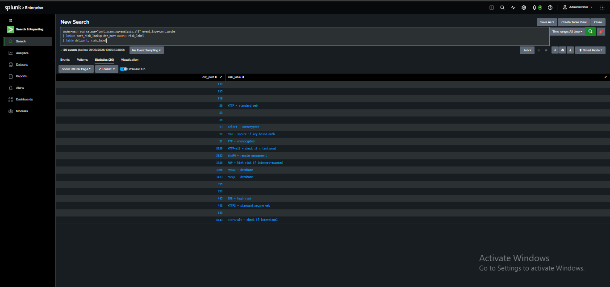
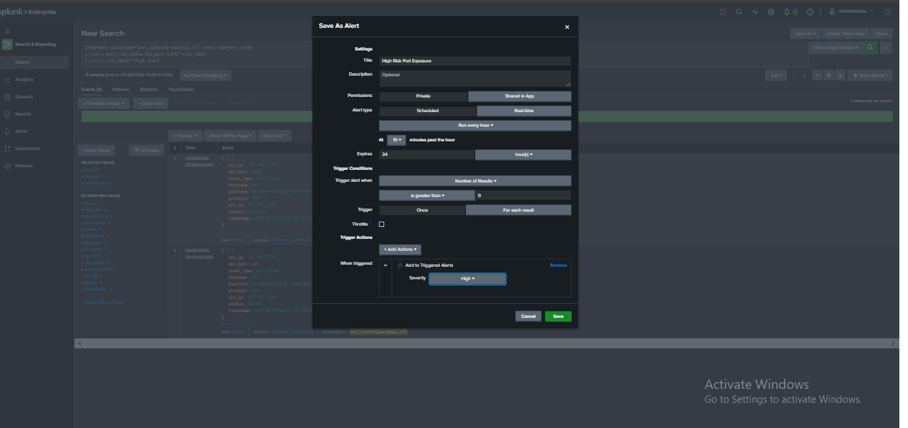
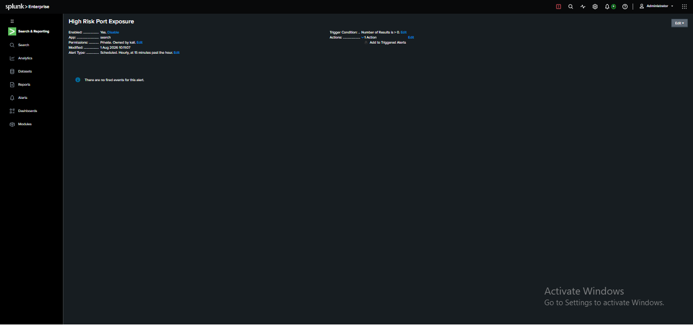
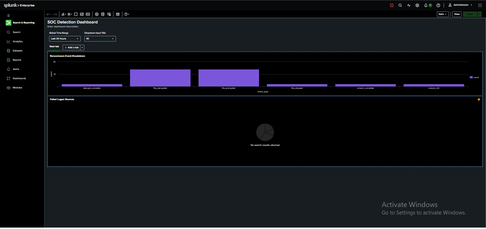
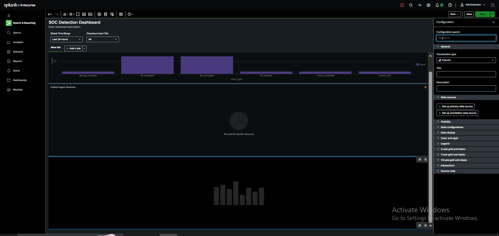
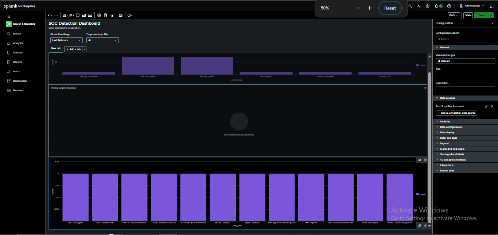

# Port Scan Alerting & Dashboard — Splunk Automation Layer

## Objective
Convert the port scan detection logic (from the original port scan
project) into two operational SOC artifacts: a scheduled alert that
flags high-risk exposed ports, and a dashboard panel visualizing risk
distribution — closing the gap between "we can detect this" and "this
is actively monitored."

## Background
Builds directly on two prior projects:
- [Port Scan Detection](https://github.com/CyberBros435/soc-port-scan-detection-splunk) — established the detection query
- [Lookup Enrichment](https://github.com/CyberBros435/soc-lookup-enrichment-splunk) — added risk_label context per port

## Environment
- SIEM: Splunk Enterprise (local lab)
- Data Source: port scan simulation log (regenerated this session after original data expired — see Note below)
- Lookup: `port_risk_lookup` (dst_port → risk_label)

## Note on Data Loss & Recovery
The original port scan dataset was no longer present in the `main`
index this session (confirmed via `index=main | stats count by
sourcetype` and `| eventcount summarize=false index=*` — data had been
cleared, likely from local Splunk instance cleanup). Recovered by
re-running the existing `generate_portscan_log.py` script and
re-ingesting under a new sourcetype. **Lesson**: local/free-tier Splunk
instances are not guaranteed persistent storage — production
environments require explicit retention policies; lab data should be
treated as disposable and regenerable, not permanent.

## Part 1 — Alert

### Query
```spl
index=main sourcetype=<sourcetype> event_type=port_probe
| lookup port_risk_lookup dst_port OUTPUT risk_label
| search risk_label="*high risk*"
```



### Alert Configuration


| Setting | Value |
|---|---|
| Title | High Risk Port Exposure |
| Trigger condition | Number of Results > 0 |
| Schedule | Hourly, 15 minutes past the hour |
| Action | Add to Triggered Alerts |
| Severity | High |



**Note**: schedule set to hourly due to Splunk Free tier limitations on
alert frequency (same constraint documented in the ransomware alert
project) — production deployment would use a shorter interval or
real-time trigger for faster response.

## Part 2 — Dashboard Panel

Added a third panel to the existing `SOC Detection Dashboard`
(alongside Ransomware Event Breakdown and Failed Logon Sources).

### Query
```spl
index=main sourcetype=<sourcetype> event_type=port_probe
| lookup port_risk_lookup dst_port OUTPUT risk_label
| stats count by risk_label
```





**Panel title**: Port Scan Risk Assessment
**Visualization**: Column chart — one bar per distinct risk_label,
showing count of ports matching each risk category.

## Findings
- The alert correctly filters only high-risk-labeled ports (RDP, SMB, etc.) rather than firing on every scan event — reduces noise, surfaces only what matters for response.
- The dashboard panel now gives an at-a-glance view of risk distribution across all scanned ports, extending the SOC Detection Dashboard to cover reconnaissance activity alongside ransomware and credential-attack signals already present.
- Confirmed (again) that lab data in a local Splunk instance is not guaranteed to persist — a real operational finding, not just a project setback.

## What I Learned
- Alerts and dashboards are the "last mile" of detection engineering — a working query alone isn't operational until it's scheduled (alert) or visualized (dashboard) for ongoing use.
- Local Splunk lab data can silently disappear between sessions — always verify data exists (`stats count by sourcetype`) before debugging a query that returns nothing.
- Extending an existing dashboard (adding a third panel) is the correct approach when the new signal complements existing ones, rather than creating a disconnected one-off view.

## Next Steps
- Reduce alert schedule to a shorter interval if a paid/production Splunk tier is used.
- Add a 4th dashboard panel combining data from all three detection domains (ransomware, failed logons, port scans) into a single "overall risk score" view.

## Related Projects
- 🔗 [Port Scan Detection](https://github.com/CyberBros435/soc-port-scan-detection-splunk)
- 🔗 [Lookup Enrichment](https://github.com/CyberBros435/soc-lookup-enrichment-splunk)
- 🔗 [Unified Monitoring Dashboard](https://github.com/CyberBros435/soc-unified-monitoring-dashboard)
- 🔗 [Ransomware Detection & Live Alert](https://github.com/CyberBros435/ransomware-siem-analysis)